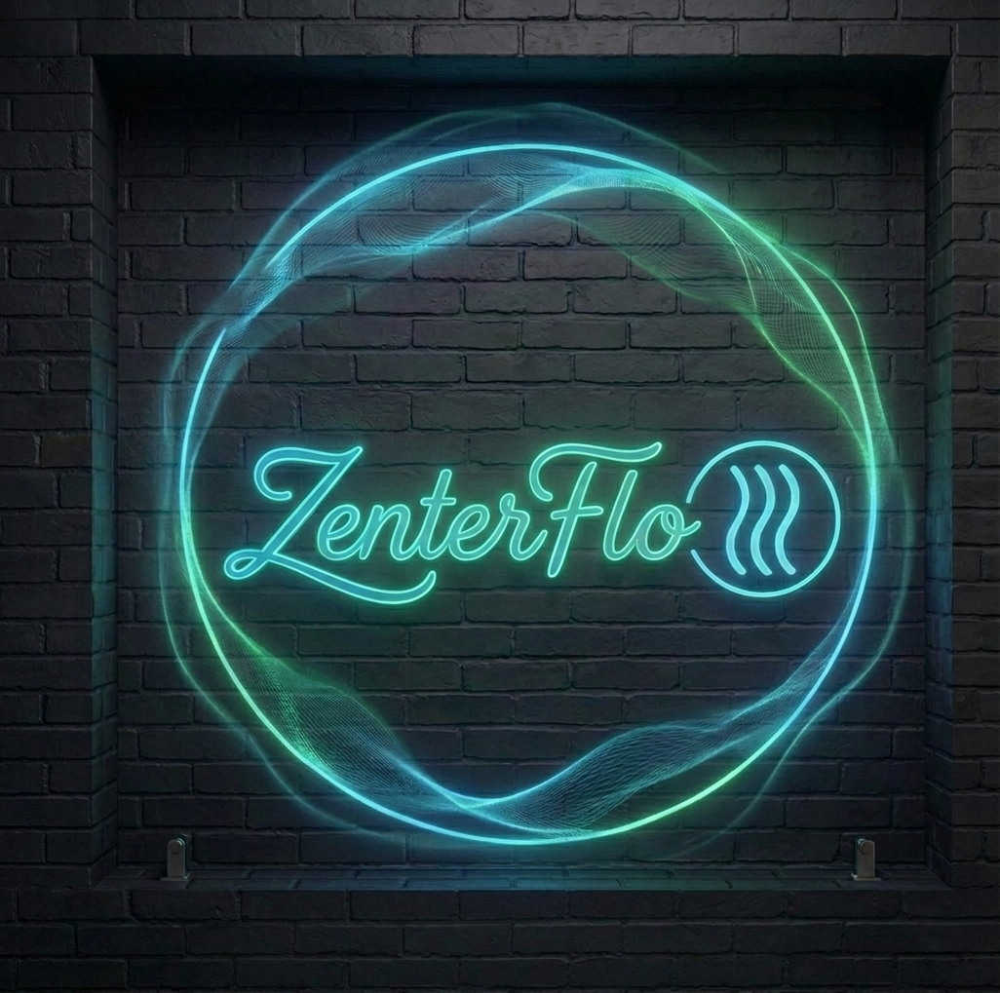

# Hi. I'm @ZenterFlow 

  

## The New Interface: When AI Agents Learn to Be Human

In a world where technology often creates distance, I'm building bridges. My work focuses on giving AI agents the most fundamentally human capabilities – the ability to build rapport through verbal and non-verbal communication, to interrupt, listen, react, respond, and sometimes even ignore. These aren't just features; they're the essence of what makes communication meaningful.

The real transformation happens when we move beyond command-and-response interfaces to agents that understand the subtle dance of human interaction. An agent that knows when to challenge your thinking, when to offer support, when to ask the penetrating question that changes everything. This is the new interface to technology – not screens and buttons, but conversation, relationship, and understanding.

My mission extends beyond the technology itself. I'm here to empower people with skills that transfer in an instant – imagine downloading the ability to fly a B515 Helicopter for Trinity, or learning Kung Fu like Neo. In our world, this means creating AI agents that don't just perform tasks, but transfer expertise, build capability, and amplify human potential.

---

## 🚀 What I'm Building

### 🤖 Agentic Systems in Production

I don't just advise on agentic systems – I build them. Here's what's deployed and working:

- **EmployAB** - Multi-agent system orchestrating complex employment workflows using Claude, Worktrees, and RuFlo
- **AI Avatars** - Deployed in MS Teams for internal communications and training at scale
- **Warranty System** - Visual recognition processing thousands of warranty claims daily across multiple regions

### 🤝 Agentic Communication Systems

Building AI agents that communicate like humans – through interruption, active listening, and nuanced responses.

| Project | Description | Status |
|---------|-------------|--------|
| 🎭 Expert Customer Avatars for Teams | Interactive agent system that joins meetings with covert questioning capabilities | Private |
| 🗣️ Rapport-Building Dialogue Engine | Framework enabling agents to build trust through verbal and non-verbal communication patterns | Private |
| 👂 Contextual Listening Agent | AI system that knows when to interrupt, when to listen, and when to ignore for effective human-agent collaboration | Private |

### 🎯 Expertise Transfer Systems

Instant skill acquisition and knowledge transfer through AI-powered interfaces.

| Project | Description | Status |
|---------|-------------|--------|
| ⚡ Instant Expertise Engine | Platform for transferring domain expertise through Claude Code Plugins | Claude Plugins |
| 🚁 Trinity Flight Simulator AI | Agent-based system for rapid skill transfer in complex operational environments | Active |
| 🥋 Neo Kung Fu Trainer | Interactive agent that adapts teaching methodology to individual learning patterns | Active |

### 🔍 Computer Vision & Automation

Bringing intelligent object recognition to enterprise workflows.

| Project | Description | Status |
|---------|-------------|--------|
| 📱 Warranty Returns Vision System | Automated object recognition for electronics warranty validation and replacement fulfillment | Production |
| 🌍 Global Fulfillment AI | Multi-language, multi-region automation system for warranty processing | Production |

---

## 🛠️ Technologies & Tools

**Languages:** Rust, Python, JavaScript, TypeScript

**AI Frameworks:** Anthropic Claude, OpenAI API, Custom Dialogue Engines

**Vision Systems:** AWS Rekognition

**Communication:** WebRTC, Socket.io, Real-time Audio Processing

**Architecture:** Multi-agent orchestration, production-ready systems, security-focused implementations

---

## 🧠 My Technology Philosophy

Technologies are tools of communication and work, therefore leverage. Building leverage for ourselves and others improves our quality of life. Every line of code I write, every agent I build, is designed to amplify human capability – not replace it, but extend it, enhance it, and make the impossible possible.

**Core Principle:** The best AI agent is one that knows when to tell you you're wrong, when to challenge your assumptions, and when to simply listen – just like the best humans do.

---

## 📊 By The Numbers

- **2,600+** contributions in the last year
- **104** repositories
- **70** stars
- **4** continents of enterprise transformation experience
- **25+** years of high-stakes programme leadership

---

## 🕹️ From Spectrum to Spark

My journey began with a Spectrum ZX81 and Commodore VIC-20 – those magical boxes that turned imagination into reality. Today, I dream of the NVIDIA DGX Spark, but the essence remains the same: these aren't just machines. They're our external representations of our continuing desire and ability to make distinctions, to push boundaries, to create what's next.

From 8-bit adventures to AI agents that understand when to interrupt you in a meeting, I've been chasing the same dream: technology that makes us more human, not less.

---

## 🌐 Connect with Me

- **Website:** [jonathanmcguinness.com](https://jonathanmcguinness.com)
- **LinkedIn:** [linkedin.com/in/jonathanmcguinness](https://linkedin.com/in/jonathanmcguinness)
- **Twitter:** [@Jon_McGuinness_](https://twitter.com/Jon_McGuinness_)
- **Email:** jonathan.mcguinness@agentlify.org

---

## 📚 Featured Content

### Blog Posts on Agentic Systems
- "Building Rapport-Based AI Agents: The Communication Framework"
- "Expertise Transfer Through AI: The Future of Training"
- "From Research to Production: Deploying Cutting-Edge AI in Enterprises"

### Speaking
- Vibe Code Fest, Zurich (2025)
- Topics: Agentic transformation, multi-agent systems, enterprise AI

### Book
- **Questions of Fire: Communications in Crisis Management** - 25 years of high-stakes programme experience distilled into practical guidance for leaders

---

## 🎯 Current Focus

- Building production-ready multi-agent systems
- Developing communication frameworks for human-AI collaboration
- Creating expertise transfer systems that democratize knowledge
- Advancing governance models for autonomous systems
- Bridging the gap between AI research and enterprise deployment

---

## 🤝 Let's Build Together

I'm interested in:
- Agentic systems and autonomous workflows
- Human-centered AI design
- Enterprise transformation
- Expertise transfer and knowledge democratization
- Building communities around emerging technologies

Feel free to reach out if you're working on similar problems or want to collaborate.

---

**⭐ Fun Fact:** I believe the best AI agent is one that knows when to tell you you're wrong, when to challenge your assumptions, and when to simply listen – just like the best humans do.
